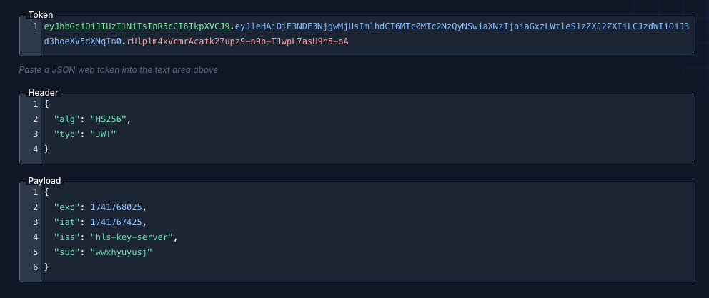

# HLS Key Server (Go)

一個高效能的 HLS 串流加密金鑰伺服器，使用 Go 實作，採用清晰架構設計，支援 JWT 認證與熱重載功能。

## ✨ 專案特色

- 🏗️ **Clean Architecture**: Handler → Service → Repository 三層架構
- 💉 **依賴注入**: 建構子注入，避免 init() 副作用
- 🔒 **類型安全**: Go 1.24+ 完整型別定義與介面抽象
- 🛡️ **錯誤處理**: Sentinel errors + errors.Is/As 模式
- 🔑 **JWT 認證**: 多種認證方式（Bearer Token、Query Param、Cookie）
- 📝 **結構化日誌**: Zap logger 依賴注入
- ⚡ **高效能**: 記憶體快取 + 47ns 金鑰存取
- 🔄 **熱重載**: 支援 SIGHUP 信號與 API 端點
- 🧪 **完整測試**: 30+ 單元/整合測試，race detector 通過
- 📚 **API 文件**: Swagger/OpenAPI 自動生成
- 🛠️ **開發工具**: Makefile + golangci-lint

## 📁 專案架構

```
hls-key-server-go/
├── cmd/
│   └── server/              # 應用程式進入點
│       └── main.go          # 依賴注入與啟動邏輯
├── internal/
│   ├── apperrors/           # Sentinel errors 定義
│   │   └── errors.go
│   ├── configs/             # 配置載入與驗證
│   │   ├── initConfig.go
│   │   ├── jwt.go
│   │   └── version.go
│   ├── handler/             # HTTP 請求處理層
│   │   ├── auth_handler.go
│   │   ├── hls_handler.go
│   │   ├── *_test.go        # HTTP 整合測試
│   │   └── middleware/
│   ├── service/             # 業務邏輯層
│   │   ├── auth.go          # JWT 認證服務
│   │   ├── hls.go           # HLS 金鑰服務
│   │   └── *_test.go
│   ├── repository/          # 資料存取層
│   │   ├── key.go           # 檔案系統金鑰儲存
│   │   └── *_test.go
│   ├── routes/              # 路由註冊
│   │   └── api/v1/
│   └── pkg/
│       └── logger/          # Logger 工廠
├── config/                  # 配置檔案
│   └── config.yaml
├── keys/                    # HLS 加密金鑰目錄
├── docs/                    # Swagger 文件
│   ├── docs.go
│   ├── swagger.json
│   └── swagger.yaml
├── Makefile                 # 開發工具命令
├── .golangci.yml            # Linter 配置
├── .gitignore
├── ARCHITECTURE.md          # 架構文件
└── README.md
```

## 🚀 快速開始

### 環境需求

- Go 1.24+
- Make（可選）

### 安裝依賴

```bash
go mod download
```

### 配置設定

編輯 `config/config.yaml`：

```yaml
app:
  name: "hls-key-server"
  mode: "debug"  # debug | release | production
  port: "9090"

jwt:
  secret: "your-secret-key-min-32-characters-long"
  issuer: "hls-key-server"
  audience: "hls-key-api"
  expiration_hours: 168  # 7 天
  header_key: "header-key"
  header_value: "your-custom-header-value"
```

### 產生加密金鑰

```bash
mkdir -p keys
openssl rand 16 > keys/stream.key
openssl rand 16 > keys/stream1.key
```

### 啟動伺服器

```bash
# 使用 Makefile
make run

# 或直接執行
go run cmd/server/main.go

# 編譯後執行
make build
./bin/hls-key-server
```

伺服器啟動後會在控制台顯示測試 JWT token（僅非 production 模式）。

## 📖 API 使用指南

### 1. 取得 JWT Token

```bash
curl -X POST "http://localhost:9090/api/v1/auth/token" \
     -H "header-key: your-custom-header-value" \
     -d "username=testuser"
```

### 回應

```json
{
  "token": "eyJhbGciOiJIUzI1NiIsInR5cCI6IkpXVCJ9..."
}
```

### 2. 取得加密金鑰

#### 方式 1: 使用 Bearer Token

```bash
curl -X POST "http://localhost:9090/api/v1/hls/key" \
     -H "Authorization: Bearer YOUR_JWT_TOKEN" \
     -d "key=stream.key"
```

#### 方式 2: 使用 Query Parameter

```bash
curl -X POST "http://localhost:9090/api/v1/hls/key?key=stream.key" \
     -H "Authorization: Bearer YOUR_JWT_TOKEN"
```

#### 方式 3: 取得預設金鑰（stream.key）

```bash
curl -X POST "http://localhost:9090/api/v1/hls/key" \
     -H "Authorization: Bearer YOUR_JWT_TOKEN"
```

**回應**：

```
HTTP/1.1 200 OK
Content-Type: application/octet-stream
Content-Length: 16

<16 bytes binary data>
```

### 3. 列出所有金鑰

```bash
curl -X GET "http://localhost:9090/api/v1/hls/keys" \
     -H "Authorization: Bearer YOUR_JWT_TOKEN"
```

**回應**：

```json
{
  "keys": ["stream.key", "stream1.key"]
}
```

### 4. 熱重載金鑰

#### 方式 1: API 端點

```bash
curl -X POST "http://localhost:9090/api/v1/hls/reload" \
     -H "Authorization: Bearer YOUR_JWT_TOKEN"
```

#### 方式 2: 系統信號

```bash
# 發送 SIGHUP 信號
kill -HUP $(pgrep hls-key-server)
```

**回應**：

```json
{
  "message": "Keys reloaded successfully",
  "count": 2
}
```

### 5. 健康檢查

```bash
curl http://localhost:9090/healthz
```

**回應**：

```json
{
  "status": "ok"
}
```

## 🛠️ 開發工具

### Makefile 命令

```bash
make help          # 顯示所有可用命令
make build         # 編譯專案
make run           # 執行伺服器
make test          # 執行測試（含 race detector）
make bench         # 執行效能測試
make lint          # 執行 linter 檢查
make fmt           # 格式化程式碼
make tidy          # 整理依賴
make clean         # 清除編譯產物
make swagger       # 生成 Swagger 文件
make docker-build  # 建立 Docker 映像
make docker-run    # 執行 Docker 容器
```

### 測試

```bash
# 執行所有測試
make test

# 執行特定套件測試
go test -v ./internal/service/...

# 執行效能測試
make bench

# 查看測試覆蓋率
go test -cover ./...
```

### Linter

```bash
# 執行 golangci-lint
make lint

# 自動修復部分問題
golangci-lint run --fix
```

## 📊 效能基準

```bash
BenchmarkFileKeyRepository_Get-10          25,000,000     47.01 ns/op     16 B/op    1 allocs/op
BenchmarkAuthService_GenerateToken-10         500,000      2,222 ns/op  3,089 B/op   46 allocs/op
BenchmarkAuthService_ValidateToken-10         350,000      3,210 ns/op  2,848 B/op   60 allocs/op
```

## 🧪 測試覆蓋

- ✅ **30+ 測試** 全部通過
- ✅ **Race detector** 無資料競爭
- ✅ **單元測試**: apperrors、repository、service
- ✅ **整合測試**: handler HTTP 層
- ✅ **Table-driven tests**: 符合 Go 最佳實踐

## 📚 API 文件

啟動伺服器後訪問 Swagger UI：

```bash
# 生成文件
make swagger

# 啟動伺服器
make run

# 訪問 Swagger UI（如果有整合）
# http://localhost:9090/swagger/index.html
```

或直接查看：

- `docs/swagger.json`
- `docs/swagger.yaml`

## 🔄 熱重載機制

伺服器支援無停機熱重載金鑰：

1. **修改或新增金鑰檔案**：

   ```bash
   openssl rand 16 > keys/new-stream.key
   ```

2. **觸發重載**：

   ```bash
   # 方式 1: SIGHUP 信號
   kill -HUP $(pgrep hls-key-server)

   # 方式 2: API 端點
   curl -X POST "http://localhost:9090/api/v1/hls/reload" \
        -H "Authorization: Bearer YOUR_JWT_TOKEN"
   ```

3. **查看日誌確認**：

   ```plaintext
   INFO    received SIGHUP, reloading keys...
   INFO    keys reloaded successfully    {"count": 3}
   ```

## 🔒 安全特性

- ✅ **JWT 認證**: HMAC-SHA256 簽名
- ✅ **路徑遍歷防護**: 禁止 `../` 等惡意路徑
- ✅ **金鑰名稱驗證**: 白名單字元檢查
- ✅ **多層防護**: Handler → Service → Repository 各層驗證
- ✅ **CORS 支援**: 可配置跨域策略
- ✅ **請求日誌**: 完整 access log 與錯誤追蹤

## 🐳 Docker 部署

```bash
# 建立映像
make docker-build

# 執行容器
make docker-run

# 或手動執行
docker build -t hls-key-server:latest .
docker run -p 9090:9090 -v $(pwd)/keys:/app/keys hls-key-server:latest
```

## 🏗️ 架構設計

遵循 **Uber Go Style Guide** 與 **Clean Architecture** 原則：

### 依賴流向

```bash
HTTP Request → Handler → Service → Repository → File System
              ↓          ↓          ↓
           Response   Business   Data Access
```

### 關鍵設計模式

1. **依賴注入**: 建構子注入，避免全域變數
2. **介面抽象**: Repository 定義介面，易於測試與替換
3. **Context 傳遞**: 所有方法第一參數為 `context.Context`
4. **錯誤包裝**: 使用 `%w` 保留錯誤鏈，`errors.Is/As` 檢查
5. **結構化日誌**: Zap logger 依賴注入
6. **Graceful Shutdown**: 5 秒超時優雅關閉

詳見 [ARCHITECTURE.md](ARCHITECTURE.md)

## 📝 JWT Token 範例

### JWT Payload 結構

```json
{
  "sub": "username",
  "iss": "hls-key-server",
  "aud": "hls-key-api",
  "iat": 1741766323,
  "exp": 1742371123
}
```

### JWT Decoder



## 🤝 貢獻指南

1. Fork 專案
2. 建立 feature branch (`git checkout -b feature/amazing-feature`)
3. 遵循 Uber Go Style Guide
4. 執行測試與 linter (`make test && make lint`)
5. Commit 變更 (`git commit -m 'Add amazing feature'`)
6. Push 到 branch (`git push origin feature/amazing-feature`)
7. 開啟 Pull Request

## 📄 授權

MIT License - 詳見 [LICENSE](LICENSE) 檔案

## 📮 聯絡方式

- **GitHub**: [vincent119/hls-key-server-go](https://github.com/vincent119/hls-key-server-go)
- **Issues**: [回報問題](https://github.com/vincent119/hls-key-server-go/issues)

---

### Built with ❤️ using Go 1.24 and Clean Architecture
